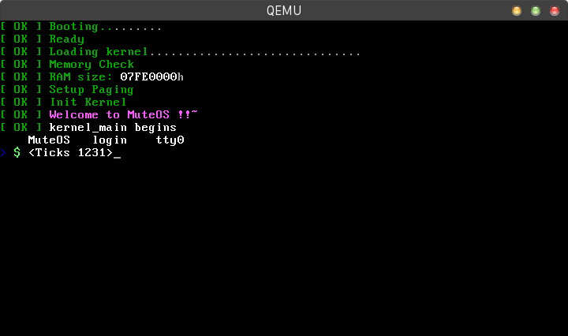
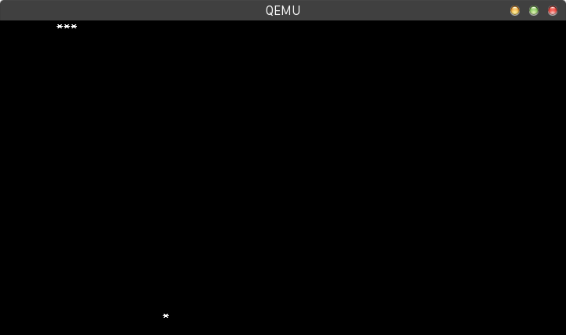
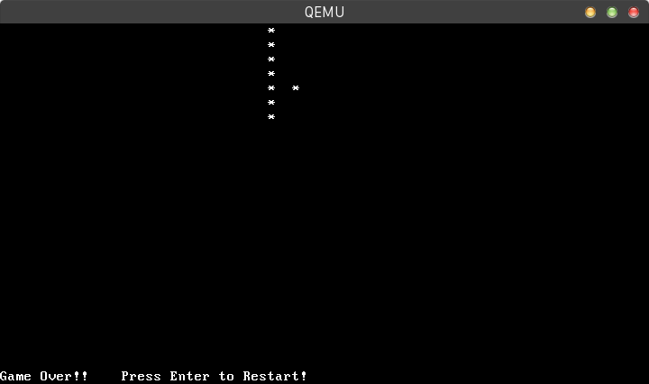

# MuteOS

**A Mini Operating System**

## Features

* Lightweight
* Monolithic kernel
* Multi-process
* Multi-console


## Hardware Requirement

CPU with x86 or x84-64 architectures. 


## Installation

Make the OS image file `MuteOS.img`:
```
git clone https://github.com/NeymarL/Muse-OS.git
cd Mute-OS
sudo make
```

if you hava installed [qemu](http://wiki.qemu.org/Main_Page), you can run by:
```
sudo make run
```

otherwise use `dd` command write it to a usb disk and then use BIOS to boot it.

## Applications

* The Snakes Game
    - See `games/snake` for details.


## Screenshot



**Snake Game**





## For More Information

My website : https://www.liuhe.website


